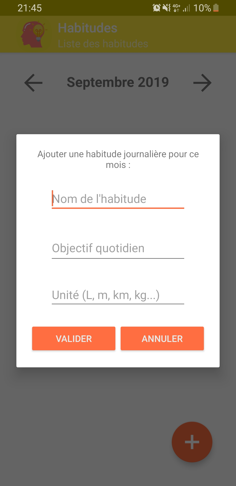
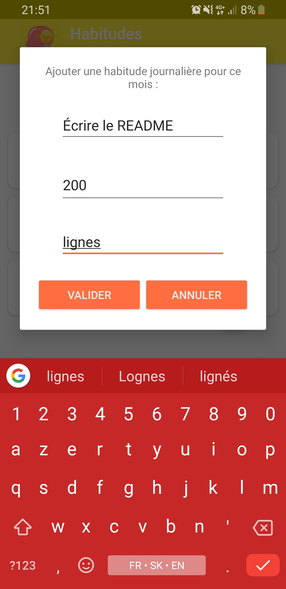
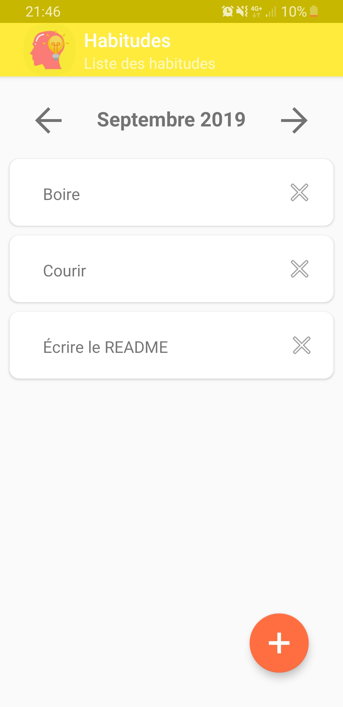
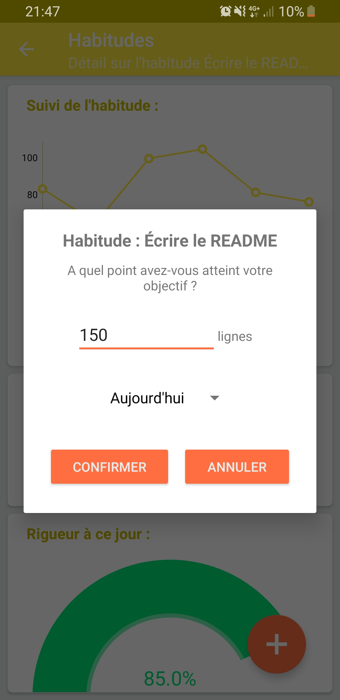
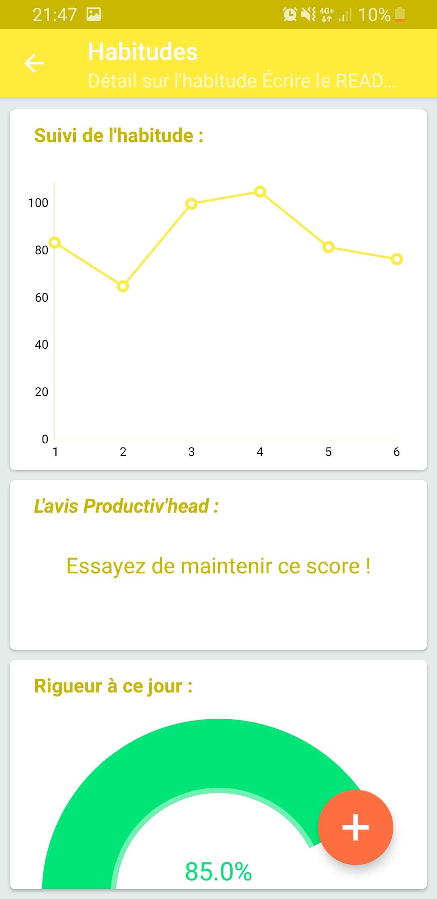

# This is the Habits module of the Productiv'Head project

## Current state of development 
- [x] Data persistancy
- [x] Announced functionnalities
- [x] Polished UI
- [ ] Fixing all bugs & issues
- [ ] Implementing optional, unplanned small features
- [ ] Cleaning up the codebase
- [ ] Merging the module into the Productiv'Head project

## Functionnalities

### Adding monthly habits

As you can see, you can add habits to the monthly scrollable list. Those can be deleted, _will be editable and shareable in the future_.

### Tracking your performance on different habits

And you can track your progress on every habit while adding your daily advancement in a dedicated activity : 

## Estimate development advancement of the module
**$65%$**